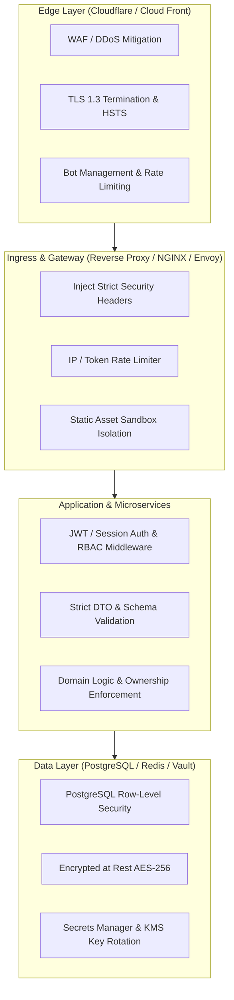

# Architecture Defense Blueprint

> Production-grade architecture patterns for designing secure multi-tier, multi-tenant, and cloud-native applications.

---

## 1. Multi-Tier Defense-in-Depth Topology



---

## 2. Multi-Tenant Data Isolation Patterns

### Pattern A: Row-Level Security (RLS) in PostgreSQL
Enforce tenant isolation directly at the database engine level, guaranteeing that even if application logic has a flaw, queries cannot read or write another tenant's rows.

```sql
-- Enable Row Level Security on the table
ALTER TABLE documents ENABLE ROW LEVEL SECURITY;

-- Create policy that forces tenant_id to match current session tenant
CREATE POLICY tenant_isolation_policy ON documents
    AS RESTRICTIVE
    USING (tenant_id = current_setting('app.current_tenant_id')::uuid)
    WITH CHECK (tenant_id = current_setting('app.current_tenant_id')::uuid);
```

### Pattern B: Automatic ORM Scoping Middleware
```python
# SQLAlchemy base query filter extension
class TenantAwareQuery(Query):
    def get_tenant_id(self):
        return get_current_request_tenant()

    def filter(self, *criterion):
        tenant_id = self.get_tenant_id()
        if tenant_id:
            criterion = (self._entities[0].type.tenant_id == tenant_id,) + criterion
        return super().filter(*criterion)
```

---

## 3. Microservice & Zero-Trust Service Mesh Security

1. **Mutual TLS (mTLS)**: Enforce cryptographic identity verification for all service-to-service communication.
2. **Short-Lived Ephemeral Credentials**: Use workload identity federation (OIDC / SPIFFE) instead of long-lived shared API keys between internal services.
3. **Egress Filtering & Private VPC Subnets**: Place backend applications and databases in private subnets with no public IPv4 route. Egress traffic must route through a strictly monitored NAT gateway or proxy.
