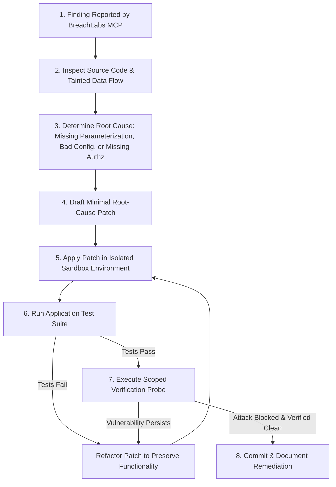

# BreachLabs Vulnerability Remediation Playbook

> Actionable, tested root-cause remediation recipes for common security vulnerabilities detected during audits.

---

## 1. Remediation Matrix

| Finding ID | Vulnerability Type | CWE | Primary Remediation Action | Verification Probe |
| :--- | :--- | :--- | :--- | :--- |
| `BL-SAST-001` | SQL Injection | CWE-89 | Replace raw string concatenation with parameterized SQL binding arguments. | DAST Probe with SQL meta-characters (`' OR '1'='1`) -> Expect sanitized 200/404 or parameterized results, 0 syntax errors. |
| `BL-SAST-003` | Command Injection | CWE-78 | Switch to array argument invocation (`subprocess.run(shell=False)`, `execFile`) and validate inputs against strict IP/alphanumeric regex. | DAST probe with `; id`, `\| whoami` -> Expect rejection or literal treatment, no subshell execution. |
| `BL-SAST-005` | IDOR / BOLA | CWE-639 | Enforce `tenant_id` and `user_id` ownership constraints in the primary SQL/ORM lookup. | Replay request with alternate authenticated user ID -> Expect `404 Not Found` or `403 Forbidden`. |
| `BL-SAST-007` | Hardcoded Secrets | CWE-798 | Extract plaintext credentials into environment variables and secrets managers. Revoke compromised keys immediately. | Static secret scanner check (`scan_secrets`) -> Expect 0 detected secrets. |
| `BL-SAST-008` | Prototype Pollution | CWE-1321 | Use `Object.create(null)` or filter dangerous keys (`__proto__`, `constructor`) before object assignment. | Post JSON with `{"__proto__": {"polluted": true}}` -> Verify `({}).polluted` is `undefined`. |
| `BL-SAST-009` | Reflected XSS | CWE-79 | Apply context-aware HTML entity escaping or use DOMPurify/sanitization libraries before rendering. | Inject `` or `` -> Expect escaped output `&lt;script&gt;...`. |
| `BL-SAST-010` | Insecure Cookie Flags | CWE-614 | Set `HttpOnly=True`, `Secure=True`, and `SameSite='Lax'` on all session cookie definitions. | Inspect `Set-Cookie` response header in DAST scan -> Verify all 3 flags are present. |

---

## 2. Step-by-Step Remediation Workflow

### Protocol for Applying Fixes:
1. **Never alter business logic unnecessarily**: Fix the security boundary without breaking valid user workflows.
2. **Prefer structural solutions over blocklists**: Use parameterization, type systems, and framework invariants instead of fragile string regex filters.
3. **Verify with retests**: Always run both the application unit tests and the targeted exploit probe to ensure zero regressions and verified fix closure.
