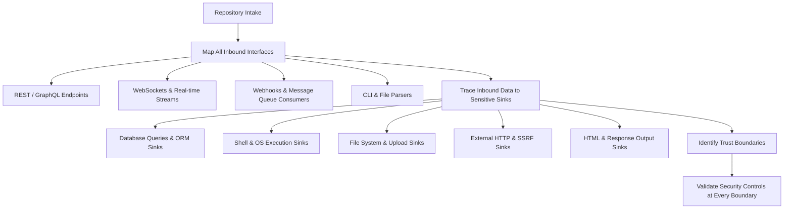

# Threat Modeling Guide for AI Agents & Engineers

> Framework for identifying attack vectors, modeling threat actors, and establishing security boundaries before and during code implementation.

---

## 1. The STRIDE Threat Modeling Framework

| Threat Category | Property Violated | Definition | Example Attack in Modern Apps | Mitigation Strategy |
| :--- | :--- | :--- | :--- | :--- |
| **Spoofing** | Authenticity | Impersonating another person, service, or process. | Stolen JWT, forged session cookie, missing request signature in webhooks. | Strong authn, asymmetric JWT signatures, HMAC webhook verification, mutual TLS. |
| **Tampering** | Integrity | Modifying data in transit or at rest without authorization. | Modifying price parameter in cart, changing `user_id` in profile payload, altering DB records. | Parameterized queries, digital signatures, HMAC checksums, immutable audit logs. |
| **Repudiation** | Non-Repudiability | Denying having performed an action due to lack of proof. | User claims they did not transfer funds; lack of audit logs prevents dispute resolution. | Tamper-evident structured audit logging, append-only logs, signed audit trails. |
| **Information Disclosure** | Confidentiality | Exposing sensitive data to unauthorized parties. | Verbose stack traces leaking DB creds, IDOR on invoices, missing tenant filters. | Context-aware access control, encryption at rest/in transit, sanitized error responses. |
| **Denial of Service** | Availability | Degradiating or interrupting service availability. | ReDoS on email validation, unthrottled password reset, memory exhaustion via large payload. | Sliding-window rate limiting, request size limits, timeout enforcement, linear regex engines. |
| **Elevation of Privilege** | Authorization | Gaining capabilities or permissions beyond what is granted. | Vertical privilege escalation from user to admin, exploiting mass assignment on `role`. | Strict RBAC/ABAC at domain layer, immutable DTOs, zero trust authorization. |

---

## 2. Attack Surface Mapping Process for Coding Agents

### Step 1: Interface Enumeration
Identify every point where external data enters the application:
- Public and private HTTP routes.
- Webhook handlers and asynchronous worker tasks.
- WebSocket message event handlers.
- Environment variables and configuration files.

### Step 2: Sink Identification
Identify all operations that execute high-risk logic:
- `db.execute()`, ORM mutations, raw SQL queries.
- `subprocess.run()`, `exec()`, `spawn()`.
- `open()`, `fs.writeFile()`, file deletions.
- `requests.get()`, `fetch()`, external network calls.
- Template rendering and direct HTML response generation.

### Step 3: Trust Boundary Verification
Ensure that every data flow crossing a trust boundary (e.g., Browser $\rightarrow$ Reverse Proxy $\rightarrow$ Application API $\rightarrow$ Database) contains:
1. **Schema Validation**: Reject malformed or unexpected data shapes immediately.
2. **Contextual Encoding / Parameterization**: Never concatenate data directly into instructions.
3. **Authorization Assertion**: Verify identity and tenant ownership at the point of action.
